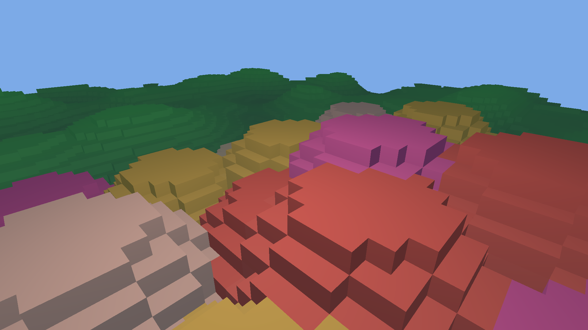

# Mariposa
 // Mariposa :: v2 //
 
 
 
This is a personal project aimed at creating a voxel game engine with Vulkan.

## Data-Oriented Design (DOD)
The project follows a Data-Oriented approach, where I aim for cache-locality, restructured struct to avoid extra unecessary size
due to struct padding and few if no unecessary abstractions around what is important: _data_. This involves seprating state and
logic into different parts, keeping data as POD (Plain Old Data) structs. By going for SoA (Struct of Arrays) rather
than AoS (Array of Structs) one can separate "hot" and "cold" data. "Hot" data is fetched very often and therefore it is beneficial
to fill the CPU caches with it. SoA gives "hot" data a better cache-locality as more of it fits into the cache-line when the "cold"
data is separate.

A popular term in game development these days is ECS (Entity-Component-System). ECS has shown to be very efficient for large amounts
of similar data components for game entities/objects. It uses the same approach of grouping data into SoA since the components are
looped through at least once every frame.

## Memory Pools
As most people quickly realise when working with malloc/calloc/realloc is that keeping track of what memory has been freed
or what part of the program will free what is confusing. The Standard Template Library offers safe wrappers for automatic memory
management, but little in the department of pre-allocating memory and reuse of addresses. I created my own memory pool system
which allows me to pre-allocate memory, recycle memory as well as get more precise debug messages relating to memory errors.

### The memory system
* **mpCreateMemoryPool** creates and allocates a block of memory and prepares it for further use.
* **mpGetMemoryRegion** fetches a sub-block of the given memory pool.
* **mpAllocateIntoRegion** reserves a sized part of a memory region, and returns a void*.
* **mpResetMemoryRegion** nulls the data in a memory region and allows one to write new data into it.
* **mpFreeMemoryRegion** releases a given region back to the memory pool and allows another part of the program
to fetch it with mpGetMemoryRegion.

## Meshing the voxels
Each mesh covers multiple voxels to execute draw calls in larger batches. Invisible triangles are culled when the mesh is created. 
I currently use an algorithm to only display the visible ones, but in the future I plan on using a fast lookup permutation table.
